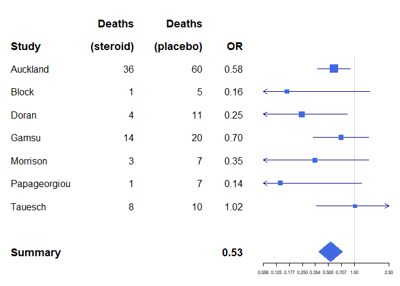

# Introduction to forest plots

by Max Gordon

Code based on :
<https://cran.r-project.org/web/packages/forestplot/vignettes/forestplot.html>

``` r
library(forestplot)
```

    ## Warning: package 'forestplot' was built under R version 4.1.2

    ## Loading required package: grid

    ## Loading required package: magrittr

    ## Loading required package: checkmate

``` r
library(dplyr)
```

    ## 
    ## Attaching package: 'dplyr'

    ## The following objects are masked from 'package:stats':
    ## 
    ##     filter, lag

    ## The following objects are masked from 'package:base':
    ## 
    ##     intersect, setdiff, setequal, union

# 

``` r
# Cochrane data from the 'rmeta'-package
cochrane_from_rmeta <- structure(list(mean  = c(NA, NA, 0.578, 0.165, 0.246, 0.700, 0.348, 0.139, 1.017, NA, 0.531), 
                                      lower = c(NA, NA, 0.372, 0.018, 0.072, 0.333, 0.083, 0.016, 0.365, NA, 0.386),
                                      upper = c(NA, NA, 0.898, 1.517, 0.833, 1.474, 1.455, 1.209, 2.831, NA, 0.731)),
                                 .Names = c("mean", "lower", "upper"), 
                                 row.names = c(NA, -11L), 
                                 class = "data.frame")
cochrane_from_rmeta
```

    ##     mean lower upper
    ## 1     NA    NA    NA
    ## 2     NA    NA    NA
    ## 3  0.578 0.372 0.898
    ## 4  0.165 0.018 1.517
    ## 5  0.246 0.072 0.833
    ## 6  0.700 0.333 1.474
    ## 7  0.348 0.083 1.455
    ## 8  0.139 0.016 1.209
    ## 9  1.017 0.365 2.831
    ## 10    NA    NA    NA
    ## 11 0.531 0.386 0.731

``` r
tabletext <- cbind(c("", "Study", "Auckland", "Block", "Doran", "Gamsu", "Morrison", "Papageorgiou", "Tauesch", NA, "Summary"),
                   c("Deaths", "(steroid)", "36", "1", "4", "14", "3", "1", "8", NA, NA),
                   c("Deaths", "(placebo)", "60", "5", "11", "20", "7", "7", "10", NA, NA),
                   c("", "OR", "0.58", "0.16", "0.25", "0.70", "0.35", "0.14", "1.02", NA, "0.53"))

tabletext
```

    ##       [,1]           [,2]        [,3]        [,4]  
    ##  [1,] ""             "Deaths"    "Deaths"    ""    
    ##  [2,] "Study"        "(steroid)" "(placebo)" "OR"  
    ##  [3,] "Auckland"     "36"        "60"        "0.58"
    ##  [4,] "Block"        "1"         "5"         "0.16"
    ##  [5,] "Doran"        "4"         "11"        "0.25"
    ##  [6,] "Gamsu"        "14"        "20"        "0.70"
    ##  [7,] "Morrison"     "3"         "7"         "0.35"
    ##  [8,] "Papageorgiou" "1"         "7"         "0.14"
    ##  [9,] "Tauesch"      "8"         "10"        "1.02"
    ## [10,] NA             NA          NA          NA    
    ## [11,] "Summary"      NA          NA          "0.53"

``` r
cochrane_from_rmeta %>% 
  forestplot(labeltext = tabletext, 
             is.summary = c(rep(TRUE, 2), rep(FALSE, 8), TRUE), #Make Text Bold to highlight Summary rows
             clip = c(0.1, 9.5),  #Lower and upper limits for clipping confidence intervals to arrows
             xlog = TRUE,  #Log scale on X axis 
             col = fpColors(box = "royalblue",
                            line = "darkblue",
                            summary = "royalblue"))
```

<!-- -->

``` r
# Cochrane data from the 'rmeta'-package
base_data <- tibble(mean  = c(0.578, 0.165, 0.246, 0.700, 0.348, 0.139, 1.017), 
                    lower = c(0.372, 0.018, 0.072, 0.333, 0.083, 0.016, 0.365),
                    upper = c(0.898, 1.517, 0.833, 1.474, 1.455, 1.209, 2.831),
                    study = c("Auckland", "Block", "Doran", "Gamsu", "Morrison", "Papageorgiou", "Tauesch"),
                    deaths_steroid = c("36", "1", "4", "14", "3", "1", "8"),
                    deaths_placebo = c("60", "5", "11", "20", "7", "7", "10"),
                    OR = c("0.58", "0.16", "0.25", "0.70", "0.35", "0.14", "1.02"))

summary <- tibble(mean  = 0.531, 
                  lower = 0.386,
                  upper = 0.731,
                  study = "Summary",
                  OR = "0.53",
                  summary = TRUE)

header <- tibble(study = c("", "Study"),
                 deaths_steroid = c("Deaths", "(steroid)"),
                 deaths_placebo = c("Deaths", "(placebo)"),
                 OR = c("", "OR"),
                 summary = TRUE)

empty_row <- tibble(mean = NA_real_)

cochrane_output_df <- bind_rows(header,
                                base_data,
                                empty_row,
                                summary)

cochrane_output_df
```

    ## # A tibble: 11 x 8
    ##    study        deaths_steroid deaths_placebo OR    summary   mean  lower  upper
    ##    <chr>        <chr>          <chr>          <chr> <lgl>    <dbl>  <dbl>  <dbl>
    ##  1 ""           Deaths         Deaths         ""    TRUE    NA     NA     NA    
    ##  2 "Study"      (steroid)      (placebo)      "OR"  TRUE    NA     NA     NA    
    ##  3 "Auckland"   36             60             "0.5~ NA       0.578  0.372  0.898
    ##  4 "Block"      1              5              "0.1~ NA       0.165  0.018  1.52 
    ##  5 "Doran"      4              11             "0.2~ NA       0.246  0.072  0.833
    ##  6 "Gamsu"      14             20             "0.7~ NA       0.7    0.333  1.47 
    ##  7 "Morrison"   3              7              "0.3~ NA       0.348  0.083  1.46 
    ##  8 "Papageorgi~ 1              7              "0.1~ NA       0.139  0.016  1.21 
    ##  9 "Tauesch"    8              10             "1.0~ NA       1.02   0.365  2.83 
    ## 10  <NA>        <NA>           <NA>            <NA> NA      NA     NA     NA    
    ## 11 "Summary"    <NA>           <NA>           "0.5~ TRUE     0.531  0.386  0.731

``` r
cochrane_output_df %>% 
  forestplot(labeltext = c(study, deaths_steroid, deaths_placebo, OR), 
             is.summary = summary,
             clip = c(0.1, 2.5), 
             xlog = TRUE, 
             col = fpColors(box = "royalblue",
                            line = "darkblue",
                            summary = "royalblue"))
```

<!-- -->

``` r
cochrane_output_df %>% 
  forestplot(labeltext = c(study, deaths_steroid, deaths_placebo, OR), 
             is.summary = summary,
             clip = c(0.1, 2.5), 
             hrzl_lines = list("3" = gpar(lty = 2), 
                               "11" = gpar(lwd = 1, columns = 1:4, col = "#000044")),
             xlog = TRUE,
             col = fpColors(box = "royalblue",
                            line = "darkblue", 
                            summary = "royalblue",
                            hrz_lines = "#444444"))
```

<!-- --> \# Using
Expression

``` r
data(dfHRQoL)
dfHRQoL <- dfHRQoL %>% mutate(est = sprintf("%.2f", mean), .after = labeltext)

clrs <- fpColors(box = "royalblue",line = "darkblue", summary = "royalblue")
tabletext <- list(c(NA, dfHRQoL %>% filter(group == "Sweden") %>% pull(labeltext)),
                  append(list(expression(beta)), 
                  dfHRQoL %>% filter(group == "Sweden") %>% pull(est)))

dfHRQoL %>% 
  filter(group == "Sweden") %>% 
  bind_rows(tibble(mean = NA_real_), .) %>% 
  forestplot(labeltext = tabletext, 
             col = clrs,                     #Set the colors for all the elements.
             xlab = "EQ-5D index")
```

<!-- --> \#
Altering Fonts

``` r
# You can set directly the font to desired value, the next three lines are just for handling MacOs on CRAN
font <- "mono"
if (grepl("Ubuntu", Sys.info()["version"])) {
  font <- "HersheyGothicEnglish"
}
dfHRQoL %>% 
  filter(group == "Sweden") %>% 
  forestplot(labeltext = c(labeltext, est), 
             txt_gp = fpTxtGp(label = gpar(fontfamily = font)),
             col = clrs,
             xlab = "EQ-5D index")
```

<!-- --> \#
Condidence Intervals

Clipping the interval is convenient for uncertain estimates in order to
retain the resolution for those of more interest. The clipping simply
adds an arrow to the confidence interval, see the bottom estimate below:

``` r
dfHRQoL %>% 
  filter(group == "Sweden") %>% 
  forestplot(labeltext = c(labeltext, est), 
             clip = c(-.1, Inf),  #Change here
             col = clrs,
             xlab = "EQ-5D index")
```

<!-- --> \#
Custom box size

``` r
dfHRQoL %>% 
  filter(group == "Sweden") %>% 
  forestplot(labeltext = c(labeltext, est), 
             boxsize = 0.2,
             clip = c(-.1, Inf),
             col = clrs,
             xlab = "EQ-5D index")
```

<!-- --> \#
Multiple confidence bands

``` r
dfHRQoL %>%
  group_by(group) %>%
  forestplot(fn.ci_norm = c(fpDrawNormalCI, fpDrawCircleCI), #how the line with the box is drawn for the normal CI
             boxsize = .25, # We set the box size to better visualize the type
             line.margin = .1, # We need to add this to avoid crowding
             clip = c(-.125, 0.075),
             shapes_gp = fpShapesGp(box = c("blue", "darkred") %>% lapply(function(x) gpar(fill = x, col = "#555555")),
                                    default = gpar(vertices = TRUE)), #Sets graphical parameters (squares and lines widths, styles, etc.)
             xlab = "EQ-5D index")
```

<!-- -->

``` r
#c("blue", "darkred") %>% lapply(function(x) gpar(fill = x, col = "#555555")
#Use this to visualize the list piped into the shape functions 
```

# Choosing line type

``` r
dfHRQoL %>%
  group_by(group) %>%
  forestplot(fn.ci_norm = c(fpDrawNormalCI, fpDrawCircleCI),#how the line with the box is drawn for the normal CI
             boxsize = .25, # We set the box size to better visualize the type
             line.margin = .1, # We need to add this to avoid crowding
             clip = c(-.125, 0.075),
             lty.ci = c(2, 1), #line type for the confidence bands,
             col = fpColors(box = c("blue", "darkred")),
             xlab = "EQ-5D index",
             ci.vertices=TRUE) #Add vertices 
```

<!-- -->

``` r
#Took out shape.gp since it will overwrite the other parameters

#lty.ci L: 1- solid line 2- dotted line 
```

# Legends

``` r
dfHRQoL %>%
  group_by(group) %>%
  forestplot(legend = c("Swedes", "Danes"),
             fn.ci_norm = c(fpDrawNormalCI, fpDrawCircleCI),
             boxsize = .25, # We set the box size to better visualize the type
             line.margin = .1, # We need to add this to avoid crowding
             clip = c(-.125, 0.075),
             col = fpColors(box = c("blue", "darkred")),
             xlab = "EQ-5D index")
```

<!-- --> \#
Ticks on Axis

``` r
dfHRQoL %>%
  group_by(group) %>%
  forestplot(fn.ci_norm = c(fpDrawNormalCI, fpDrawCircleCI),
             boxsize = .25, # We set the box size to better visualize the type
             line.margin = .1, # We need to add this to avoid crowding
             clip = c(-.125, 0.075),
             col = fpColors(box = c("blue", "darkred")),
             xticks = c(-.1, -0.05, 0, .05),
             xlab = "EQ-5D index")
```

<!-- --> - Using
object to define ticks and grids

``` r
xticks <- seq(from = -.1, to = .05, by = 0.025)
xtlab <- rep(c(TRUE, FALSE), length.out = length(xticks))
attr(xticks, "labels") <- xtlab

dfHRQoL %>%
  group_by(group) %>%
  forestplot(fn.ci_norm = c(fpDrawNormalCI, fpDrawCircleCI),
             boxsize = .25, # We set the box size to better visualize the type
             line.margin = .1, # We need to add this to avoid crowding
             clip = c(-.125, 0.075),
             col = fpColors(box = c("blue", "darkred")),
             xticks = xticks,
             xlab = "EQ-5D index")
```

<!-- --> \#
Adding Grids

``` r
dfHRQoL %>%
  group_by(group) %>%
  forestplot(fn.ci_norm = c(fpDrawNormalCI, fpDrawCircleCI),
             boxsize = .25, # We set the box size to better visualize the type
             line.margin = .1, # We need to add this to avoid crowding
             clip = c(-.125, 0.075),
             col = fpColors(box = c("blue", "darkred")),
             grid = TRUE,
             xticks = c(-.1, -0.05, 0, .05),
             zero = 0,
             xlab = "EQ-5D index")
```

<!-- -->

``` r
dfHRQoL %>%
  group_by(group) %>%
  forestplot(fn.ci_norm = c(fpDrawNormalCI, fpDrawCircleCI),
             boxsize = .25, # We set the box size to better visualize the type
             line.margin = .1, # We need to add this to avoid crowding
             clip = c(-.125, 0.075),
             col = fpColors(box = c("blue", "darkred")),
             grid = structure(c(-.1, -.05, .05), 
                              gp = gpar(lty = 3, col = "#CCCCFF")), 
             xlab = "EQ-5D index")
```

<!-- -->
